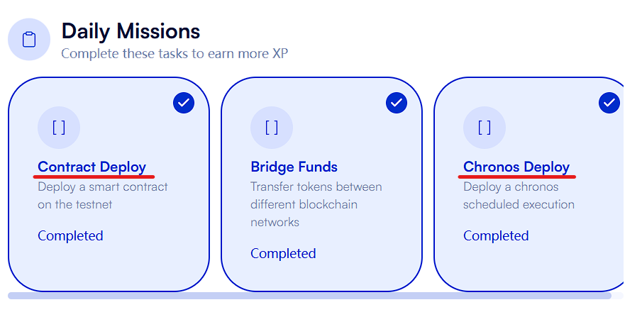
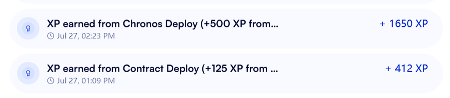

**🚀 Helios-Cron Automated Task Scheduler**

[中文](README.md) | English

**Beginner-Friendly, Easy to Use**  
**One-Click Smart Contract Deployment with Local Secure Code Execution**

**Make your smart contracts execute automatically every 6 minutes, get started in 3 minutes!**

**Quickly Complete Daily Missions**
 


## ⚡ Quick Start

### 1. Installation
```bash
git clone https://github.com/dinhdu2704/helios-cron.git
cd Helios-Cron
npm install
```

### 2. Configuration
Edit the `.env` file, only need to fill in your private key:
```env
PRIVATE_KEY=your_wallet_private_key
# Other configurations use default values
```
The `.env` file runs locally and will not be uploaded to servers, safe to use.

### 3. One-Click Deploy Contract
```bash
npm run deploy
```

The script will automatically:
- Compile smart contract
- Deploy to Helios Testnet
- Auto-update contract address in `.env` file
- Display deployment success information

### 4. Start Task
```bash
npm start
```

Success when you see `🎉 Task completed!`


## 💰 Test Token Gas Fees

- Per execution: ~0.0006 HLS
- Deposit amount: 0.02 HLS
- Runtime: About 3-4 hours
- Execution frequency: Every 6 minutes

## 🛠️ Manual Deployment (Optional)

If automatic deployment fails, you can use Remix for manual deployment:

1. Open [Remix IDE](https://remix.ethereum.org/)
2. Create new file, copy `contracts/TickContract.sol` code
3. Compile contract (Solidity 0.8.19+)
4. Connect MetaMask to Helios Testnet:
   ```
   Network Name: Helios Testnet
   RPC URL: https://testnet1.helioschainlabs.org
   Chain ID: 7001
   Currency Symbol: HLS
   ```
5. Deploy contract successfully, get contract address 'CONTRACT= 0x...'
6. Fill contract address into `TARGET_CONTRACT` in `.env` file

## 🔒 Security Information

### ✅ Local Runtime Security
- **Private key stored locally**: Never uploaded to any server
- **Open source transparency**: All code is publicly auditable
- **No malicious code**: Clean code, no backdoors
- **Minimal permissions**: Only accesses necessary blockchain interfaces

### 🛡️ Security Recommendations
- Use a dedicated wallet, don't use your main wallet with large funds
- Practice on testnet first, consider mainnet after familiarity
- Regularly check balance and task execution status
- Never share `.env` file or private key with anyone


## 🆘 Common Issues

### Insufficient Balance
Solution: Get HLS from Helios testnet faucet

### Configuration Error
Ensure:
- Private key format is correct (starts with 0x, 66 characters)
- `.env` file exists and is configured correctly
- Wallet has sufficient HLS balance (at least 0.1 HLS)

### Network Issues
```bash
npm start  # Script will automatically retry 3 times
```

### Contract Deployment Failed
```bash
# Install compiler
npm install solc

# Redeploy
npm run deploy
```

## 📁 Project Structure

```
├── cron-counter.js              # Main program
├── deploy.js                    # Contract deployment script
├── cronManager.js               # Task manager
├── config.js                    # Configuration management
├── utils.js                     # Utility functions
├── contracts/TickContract.sol   # Smart contract source code
├── .env.example                 # Configuration template
└── package.json                 # Project configuration
```

## 🔧 Configuration Options

All configurations are in the `.env` file, beginners can use default values:

| Config Item | Description | Default Value |
|-------------|-------------|---------------|
| `PRIVATE_KEY` | Wallet private key | **Required** |
| `TARGET_CONTRACT` | Target contract address | Auto-filled when deployed |
| `RPC_URL` | RPC node | Helios Testnet |
| `FREQUENCY` | Execution frequency (blocks) | 300 (~6 minutes) |
| `GAS_LIMIT` | Gas limit | 300000 |
| `GAS_PRICE` | Gas price (gwei) | 2 |
| `DEPOSIT` | Deposit amount (HLS) | 0.02 |
| `VALIDITY_WEEKS` | Validity period (weeks) | 2 |

## 💡 How It Works

1. **Deploy Contract**: Create smart contract with `tick()` function
2. **Register Task**: Call Helios Cron precompile contract to create scheduled task
3. **Deposit Fees**: Pre-deposit HLS as execution fees
4. **Auto Execute**: System automatically calls contract every 300 blocks
5. **Fee Deduction**: Each execution deducts gas fees from deposited amount

## 📄 License
MIT License
